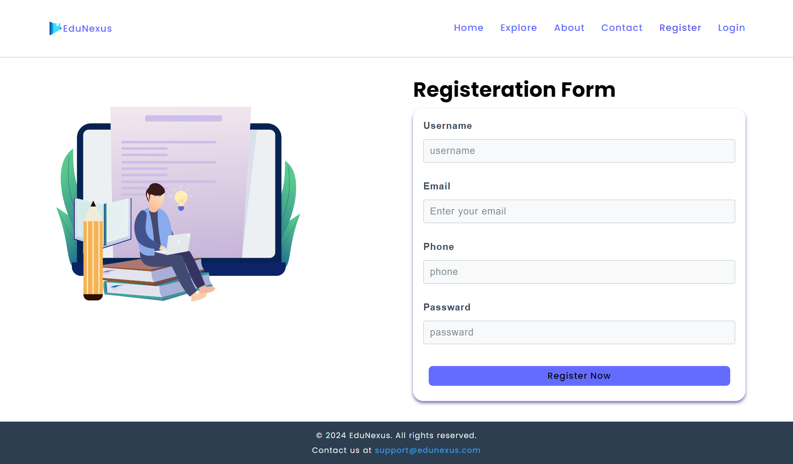
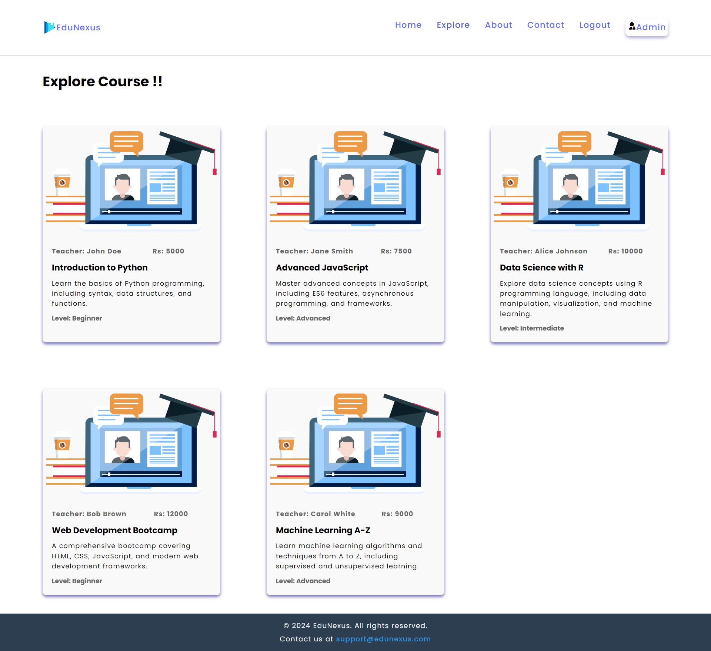
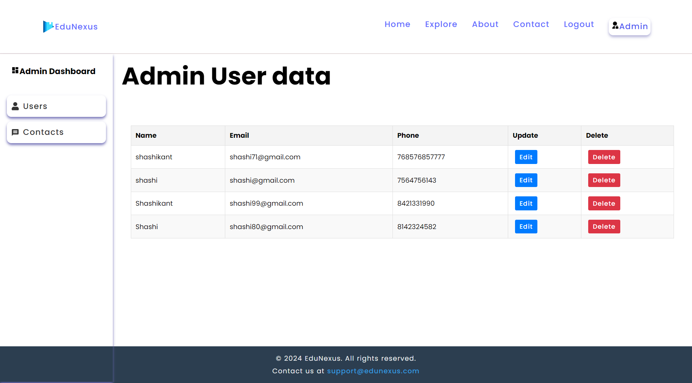

# EduNexus - E-learning Platform

EduNexus is a comprehensive E-learning platform built using the MERN stack (MongoDB, Express, React, Node.js). It provides a user-friendly interface for students to explore and enroll in courses, and an admin panel to manage users and contact messages. The platform includes robust authentication and authorization mechanisms using JWT tokens.

## Table of Contents

- [Features](#features)
- [Technologies](#technologies)
- [Installation](#installation)
- [Usage](#usage)
- [Screenshots](#screenshots)
- [Contact](#contact)

## Features

### User Features
- **User Authentication**: Register, login, and logout functionality.
- **Course Exploration**: Browse and search for courses.
- **Contact Admin**: Send messages to the admin.

### Admin Features
- **User Management**: View, edit, and delete user data.
- **Message Management**: View and manage contact messages.

## Technologies

- **Frontend**: React.js, Redux, Bootstrap
- **Backend**: Node.js, Express.js
- **Database**: MongoDB
- **Authentication**: JWT (JSON Web Tokens)

## Installation

1. **Clone the repository:**
   ```bash
   git clone https://github.com/yourusername/EduNexus.git
   cd EduNexus
2. **Install server dependencies:**
   ```bash
   cd server
   npm install
3. **Install client dependencies:**
   ```bash
     cd ../client
     npm install
  
4. **Set up environment variables:**
  Create a .env file in the server directory with the following content:
   ```bash
     MONGO_URI=your_mongo_database_uri
    JWT_SECRET=your_jwt_secret
   
5. **Run the application:**
   ```bash
   //server
   cd server
   npm start
   //client
   cd ../client
   npm start
6. **Open the application:**
   - Navigate to http://localhost:5173 in your browser.


## Usage

- **User Authentication**
  - Register a new account or log in with existing credentials.
  - JWT tokens are used to manage sessions and authorize users.

- **Course Exploration**
  - Browse the list of available courses.
  - Search for specific courses using the search functionality.

- **Contact Admin**
  - Send messages to the admin through the contact form.

- **Admin Panel**
  - Access the admin panel to view, edit, or delete users.
  - View and manage messages sent by users.


## Screenshots

## Home Page


## Register


## Courses


## Admin Panel



## Contact

For any inquiries or feedback, please contact:

- **Email**: shashikantpawase71@gmail.com

